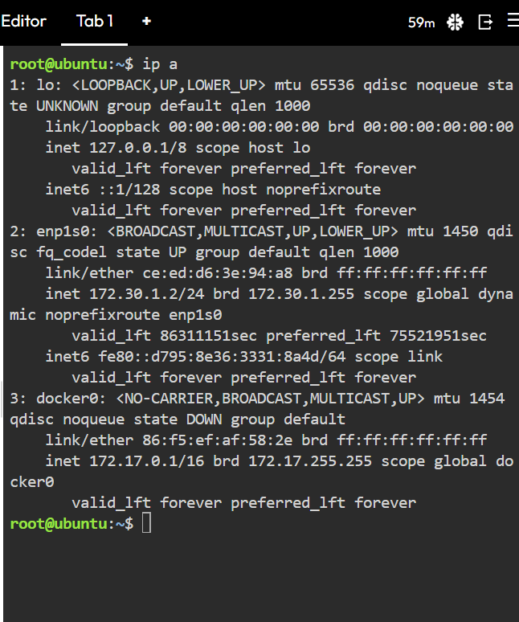
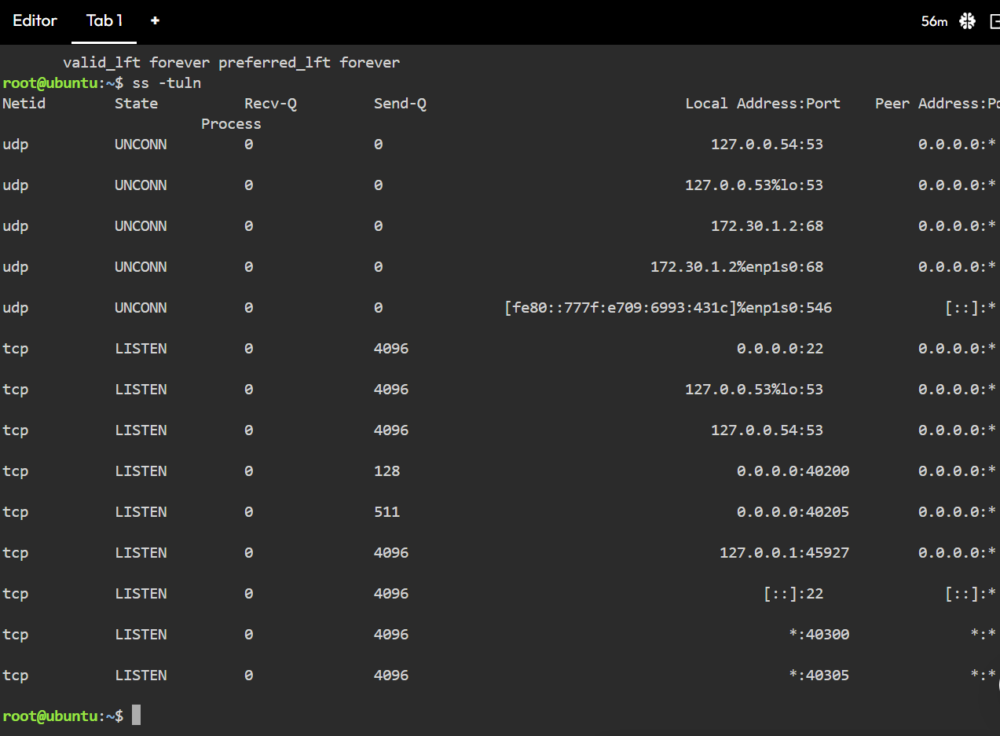
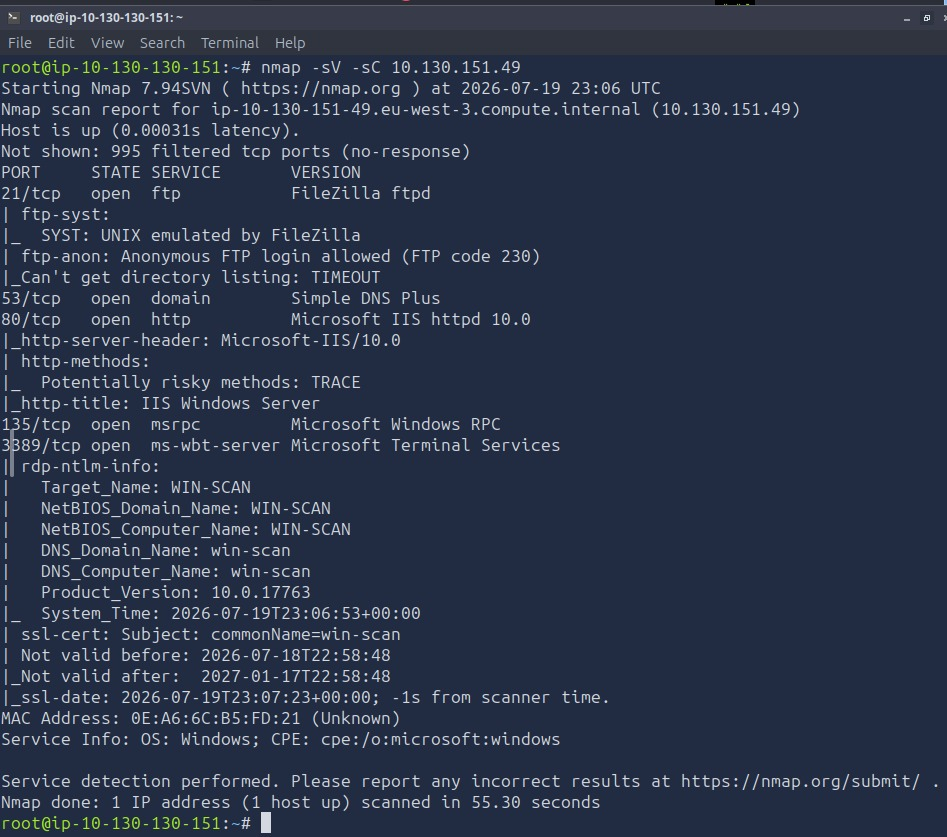

# Sessão 01 – Introdução ao Linux para Segurança e Comandos de Rede

## Curso
**Reskilling – Linux e Cibersegurança**

**Módulo:** Linux e Cibersegurança  
**Formador:** Péricles Borges
**Formando:** Paulo Vieira
---

# Objetivo

Realizar o reconhecimento do ambiente Linux e efetuar a análise de um alvo remoto utilizando o Nmap, identificando interfaces de rede, serviços em execução e versões dos serviços detetados.

---

# Ambiente Utilizado

- Ubuntu Playground (KillerCoda)
- TryHackMe – Further Nmap

---

# Comandos Executados

## Identificação da interface de rede

```bash
ip a
```

## Listagem das portas em escuta

```bash
ss -tuln
```

## Scan do alvo com deteção de versões e scripts padrão

```bash
nmap -sV -sC 10.130.151.49
```

---

# Resultados Obtidos

## 1. Número de portas abertas

Foram identificadas **5** portas abertas.

---

## 2. Serviços em execução

| Porta | Protocolo | Serviço | Estado |
|--------|-----------|----------|--------|
| 21 | TCP | ftp | Open |
| 53 | TCP | domain (DNS) | Open |
| 80 | TCP | http | Open |
| 135 | TCP | msrpc | Open |
| 3389 | TCP | ms-wbt-server (RDP) | Open |


---

## 3. Versões detetadas pelo Nmap

| Porta | Serviço | Versão |
|--------|----------|---------|
| 21 | FTP | FileZilla ftpd |
| 53 | DNS | Simple DNS Plus |
| 80 | HTTP | Microsoft IIS httpd 10.0 |
| 135 | MSRPC | Microsoft Windows RPC |
| 3389 | RDP (ms-wbt-server) | Microsoft Terminal Services |
---


## Evidências

### Output do comando ip a



### Output do comando ss -tuln



### Output do Nmap



---

# Conclusão

Durante esta sessão foi possível:

- Identificar a interface de rede do sistema Linux.
- Verificar os serviços locais em escuta.
- Utilizar o Nmap para realizar o reconhecimento de um sistema remoto.
- Identificar portas abertas, serviços disponíveis e respetivas versões.
- Interpretar a informação recolhida como parte do processo de reconhecimento em cibersegurança.