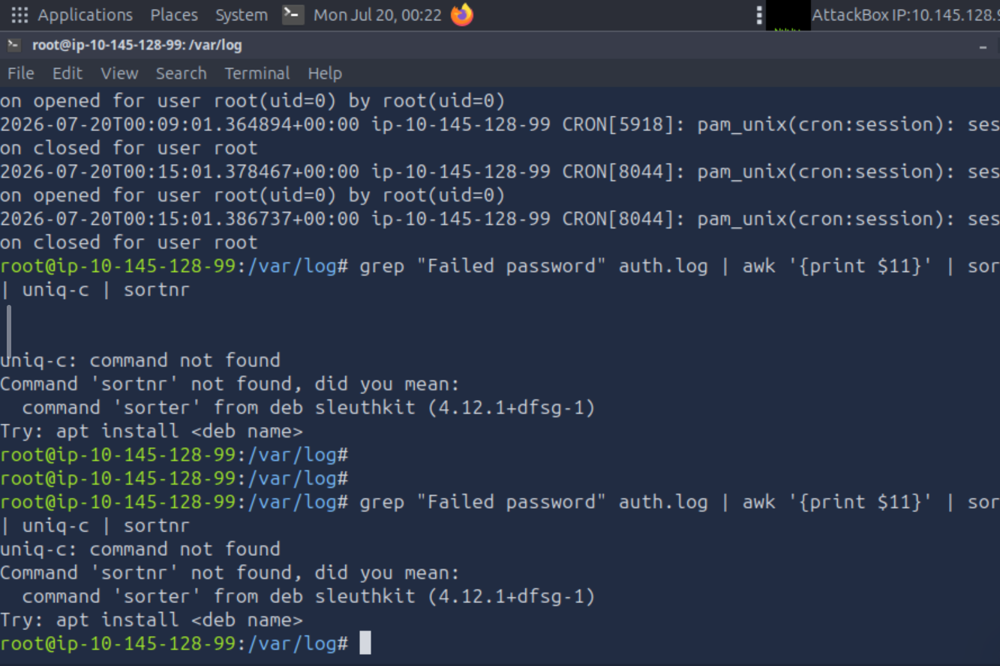
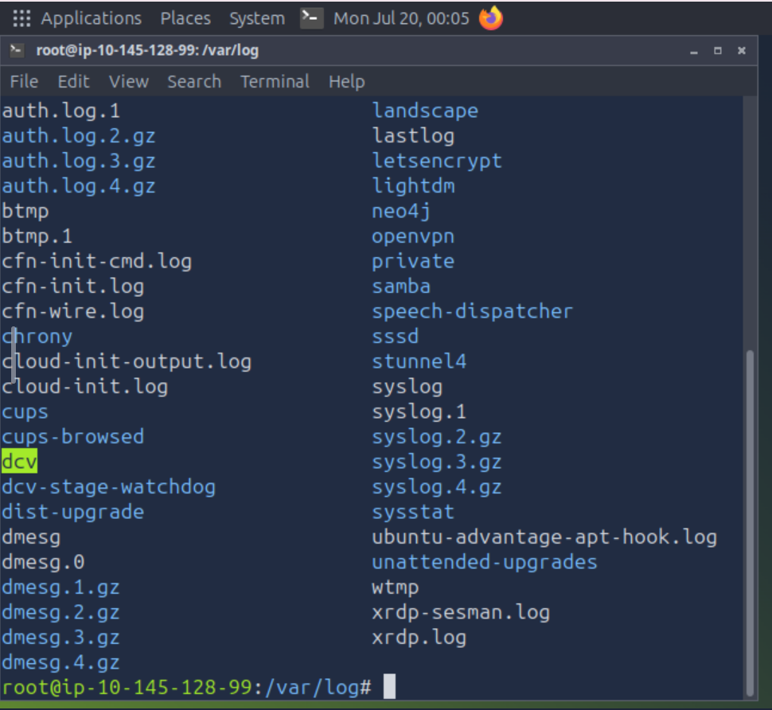

# Sessão 02 – Auditoria de Sistemas Linux e Análise Avançada de Logs

## Curso
**Reskilling – Linux e Cibersegurança**

**Módulo:** Linux e Cibersegurança  
**Formador:** Péricles Borges
**Formando:** Paulo Vieira

## Objetivo

Analisar os logs de autenticação de um servidor Linux para identificar tentativas de acesso não autorizado e confirmar se houve comprometimento do sistema.

---

## Comandos executados

```bash
cd /var/log

grep "Failed password" auth.log

grep "Failed password" auth.log | awk '{print $11}' | sort | uniq -c | sort -nr

grep -E "Accepted password|Accepted publickey" auth.log
```

---

## IP do atacante

**não encontrado**

---

## Hora do comprometimento

**não encontrado**

---

## Utilizador afetado

**não encontrado**


## Evidências




---

## Conclusão

Durante a realização do laboratório foram executados os procedimentos de análise aos ficheiros de log, conforme descrito no guião. No entanto, o ficheiro `auth.log` disponível no ambiente de laboratório não continha registos de tentativas de autenticação falhadas nem de autenticações bem-sucedidas (`Failed password`, `Accepted password` ou `Accepted publickey`). Por esse motivo, não foi possível identificar o endereço IP do atacante, o utilizador comprometido, o momento exato do comprometimento ou construir a linha temporal do ataque. Ainda assim, a atividade permitiu consolidar conhecimentos sobre a localização dos logs de autenticação, a utilização de comandos como `grep`, `awk`, `sort` e `uniq` para análise de registos, e a importância da recolha de evidências em processos de auditoria e análise forense em sistemas Linux.