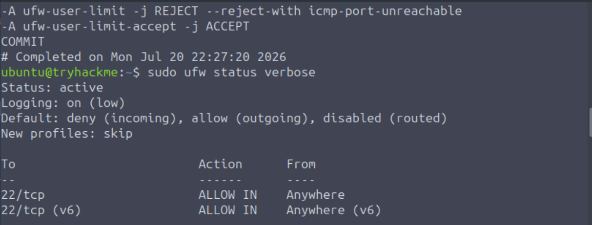
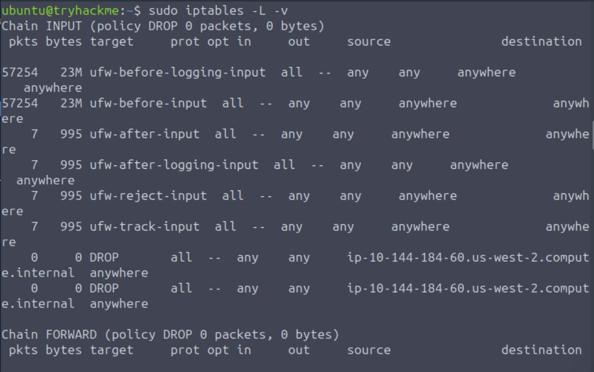

# Laboratório de Segurança de Redes: Configuração e Validação de Firewall
Este sessão contém a documentação prática e os registros de validação da aplicação de regras de bloqueio de tráfego usando **UFW** (*Uncomplicated Firewall*) e **iptables** em ambiente Linux.

## Curso
**Reskilling – Linux e Cibersegurança**

**Módulo:** Linux e Cibersegurança  
**Formador:** Péricles Borges
**Formando:** Paulo Vieira
---

## Objetivo

O objetivo deste laboratório foi aplicar uma regra de bloqueio de endereço IP malicioso/simulado e validar a eficácia do bloqueio no sistema operacional através das ferramentas nativas de firewall.

* **IP Alvo para Bloqueio:** `10.144.184.60`
* **Ambiente:** Linux (Ubuntu/Debian)
* **Ferramentas Utilizadas:** `ufw`, `iptables`

---

## 🛠️ Comandos Executados

### 1. Aplicação da Regra de Bloqueio
```bash
sudo ufw deny from 10.144.184.60
```

---

## ✅ ## Evidências

### 1. Status Detalhado do UFW (`sudo ufw status verbose`)



### 2. Listagem de Regras do IPTables (`sudo iptables -L -v`)



---

##  Conclusão

A regra de bloqueio foi inserida com sucesso na cadeia de entrada (`INPUT`) do sistema. Os testes de validação confirmam que o tráfego originado a partir do IP especificado será descartado (`DROP` / `DENY`), protegendo a infraestrutura contra acessos não autorizados.